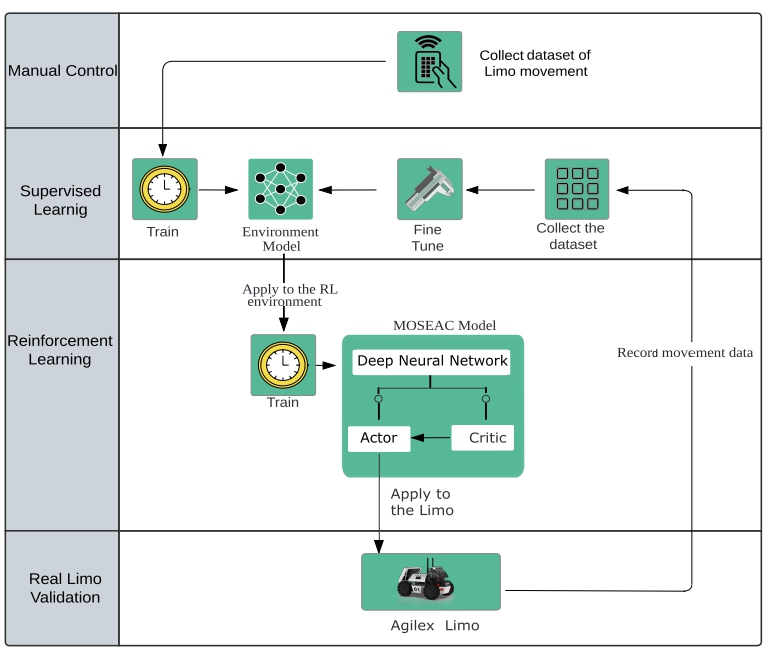
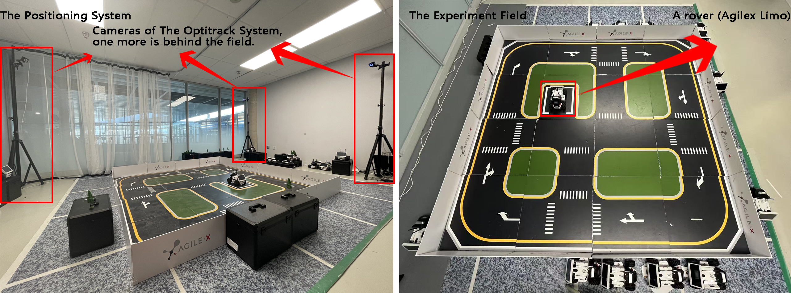
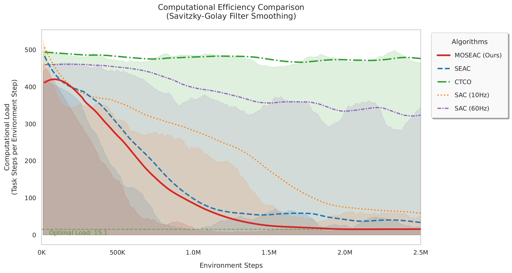

# MOSEAC Implementation on Trackmania

Please go to ```trackmania``` folder to see the details.

# MOSEAC Implementation on Agilex Limo

This repository contains the implementation of the MOSEAC algorithm for the Agilex Limo, designed for a Reinforcement 
Learning (RL) navigation task.


## Workflow and Test Environment

The workflow is applied to both simulation and real-world environments, as shown below:
[README.md](trackmania/README.md)


We use [OptiTrack](https://www.optitrack.com/) for location tracking, as illustrated below:



If you're using OptiTrack, update the IP address in `Dataset.py` and `action_publisher.py`. For setup instructions, 
refer to the [OptiTrack Quick Start Guide](https://docs.optitrack.com/quick-start-guides/quick-start-guide-getting-started). 
Otherwise, find an alternative method for location tracking in these files.


## Collecting Data with the Real Limo

To get started, clone the repository and copy the `Dataset.py` file to your Limo:

```bash
git clone https://github.com/alpaficia/MOSEAC_Limo.git
scp PATH_TO_REPO/MOSEAC_Limo/limo_sim/transformer/Dataset.py agilex@LIMO_IP_ADDRESS:PATH_TO_YOUR_FOLDER
```

Select a site (we used the default Limo map) and prepare a joystick to control the Limo.

Once your Limo is set up on the map, enable basic control. We provide two simulation modes: FourWheels and Ackerman. 
Details can be found [here](https://github.com/agilexrobotics/limo-doc).

Enable basic control and joystick control (Limo uses ROS melodic by default; modify commands if using another ROS 
version):

On the real Limo with Ubuntu 18.04 OS:

```
cd agilex_ws
catkin build
cd source devel/setup.bash
roslaunch limo_base limo_base.launch
rosrun joy joy_node
rosrun teleop_twist_joy teleop_node
```
Press the A button on the joystick to control your Limo. Once ready, launch the dataset collection code:

```python3 PATH_TO_YOUR_FILE/Dataset.py```

Press the S button to start collection, play with your Limo, and press T to stop. Collect at least 50,000 data points.

## Training the Environment Model

Ensure you have PyTorch installed. If not, follow the guide [here](https://pytorch.org/). Then launch the training code:

```bash
python3 PATH_TO_FOLDER/MOSEAC_Limo/limo_sim/transformer/train.py
```
Then launch the training code to get the environment model, **remember to change the path** in side the training code:

`python3 PATH_TO_THE_FOLDER/MOSEAC_Limo/limo_sim/transformer/train.py` (If you are using the Ackerman Mode)

Or `python3 PATH_TO_THE_FOLDER/MOSEAC_Limo/limo_sim/transformer/train_4w.py` (If you are using the FourWheel Mode)

## Training the MOSEAC Policy

Edit the model path in `MOSEAC_Limo/limo_sim/envs/limo_world.py` to upload your trained environment. Then launch 
the MOSEAC training:


`python3 PATH_TO_THE_FOLDER/MOSEAC_Limo/limo_sim/main.py`

More details can be found in main.py, MOSEAC.py, and limo_world.py. If you're interested in the implementation, 
please check these files.

After training, use tensorboard to check the logs and find the best model. You'll need the moseac_actor{id}.pth file 
for the next step.


## Validate the performance on the real limo

We applied the model to the Limo using TensorRT. First, you need to install cuDNN and TensorRT. Since the Limo is 
equipped with the older Nvidia Jetson Nano, it only supports up to JetPack 4.6, which runs with 
[cuDNN 8.2](https://drive.google.com/file/d/1XyUzO00QNxRwpXTVjrTII5ZzzRFCMUw5/view?usp=drive_link) and 
[TensorRT 8.2](https://drive.google.com/file/d/1O1CRFPdrCF_6wgtc7QUWWe5GPnK3xkwW/view?usp=drive_link). These versions 
are no longer available online, so we have provided the sources for download and installation on your Limo.

In your PC:

You should also install the `ONNX` package for the model explain and translation by:

`pip3 install onnx==1.13.0`

Edit the `PATH_TO_YOUR_FOLDER/MOSEAC_Limo/limo_ws/src/limo_policy/src/pth2onnx.py` file, change the id number to your
model id, and move your pth model to this folder `PATH_TO_YOUR_FOLDER/MOSEAC_Limo/limo_ws/src/limo_policy/src/model/`

Then translate the pth model to the onnx model by:

`python3 PATH_TO_YOUR_FOLDER/MOSEAC_Limo/limo_ws/src/limo_policy/src/pth2onnx.py`

If you see: `pth model has been transformed to a onxx file`, it means that your model has been translated.

After that, you need to copy the whole `limo_ws` to the real limo, the following operations are happened in the limo.

In the real Limo Ubuntu 18.04 OS:

Make sure you have the ros-python package installed:

`sudo apt install python3-rospy`

`sudo apt install python3-rosdep python3-rosinstall python3-rosinstall-generator python3-wstool build-essential`

`pip install rospkg catkin_pkg`

`sudo rosdep init`

`rosdep update`

Then:

`cd PATH_TO_YOUR_FOLDER/limo_ws`

`catkin build`

`cd src/limo_poilcy/src`

`pip3 install -r requirement.txt`

`python3 onnx2engine.py` (You can't create the engine file in your PC, TensorRT has different processing structures for 
different GPUs)

Once you see the `Engine file has been built.` message, it means that you can be applied your simulation model into the 
real Limo in the real world. Change paths in `action_publisher.py` for the model and the dataset saving, the final 
steps are:

Open a new terminal:

`cd agilex_ws`

`source devel/setup.bash`

`roslaunch limo_base limo_base.launch`

Then goes back to the old terminal:

`roslaunch limo_policy nav_rl.launch`

## Environment Fine Tune

You may notice a gap between the simulation environment and the real-world performance due to the high frequency of 
joystick control, which can affect the simulated environment. To address this, you need to fine-tune the model. We 
have defined the `is_point_in_polygon` function in the `action_publisher.py` file as a safety measure, which stops 
the Limo when it moves out of the map. You can modify this function to suit your needs.

You can find that the state and action values are stored to the path you are given. Copy them from the Limo to your PC.

In your PC:

Edit the path in the `PATH_TO_YOUR_FOLDER/MOSEAC_Limo/limo_sim/transformer/fine_tune.py`, then:

`python3 PATH_TO_YOUR_FOLDER/MOSEAC_Limo/limo_sim/transformer/fine_tune.py` to fine tune your environment model, if you 
are using the four wheels model, please update the `limo_model_with_friction_and_power` function to the four wheel model.

After that, you need to retrain your MOSEAC model. You can enable the check point function in the `main.py` file to 
reduce the training time.

Enjoy the life :)

## Transformer (environment model) Hypermeter Sheet

| Hyperparameter     | Value | Description                                                   |
|--------------------|-------|---------------------------------------------------------------|
| input_dim          | 7     | Number of input features for the model                        |
| output_dim         | 2     | Number of output features for the model                       |
| dropout_rate       | 0.1   | Dropout rate for regularization                               |
| d_model            | 128   | Dimension of the input and output of the transformer layers   |
| nhead              | 8     | Number of heads in the multi-head attention mechanism         |
| num_layers         | 3     | Number of transformer encoder layers                          |
| lr                 | 0.001 | Learning rate for the optimizer                               |
| weight_decay       | 1e-4  | Weight decay (L2 regularization) for the optimizer            |
| batch_size         | 64    | Batch size for training and validation                        |
| early_stopping_patience | 10    | Patience for early stopping                                   |
| epochs             | 200   | Maximum number of training epochs                             |


## MOSEAC Hypermeter Sheet for the above result

| Name                                        | Value           | Annotation                                       |
|---------------------------------------------|-----------------|--------------------------------------------------|
| **Total steps**                             | 3e6             |                                                  |
| **$\gamma$**                                | 0.95            | Discount factor                                  |
| **Net shape**                               | (256, 256, 256) |                                                  |
| **batch\_size**                             | 256             |                                                  |
| **a\_lr**                                   | 3e-4            | Learning rate of Actor Network                   |
| **c\_lr**                                   | 3e-4            | Learning rate of Critic Network                  |
| **max\_steps**                              | 500             | Maximum steps for one episode                    |
| **$\alpha$**                                | 0.12            |                                                  |
| **$\eta$**                                  | -3              | Refer to [SAC](https://arxiv.org/pdf/1812.05905) |
| **min\_time**                               | 0.02            | Minimum control duration, in seconds             |
| **max\_time**                               | 0.5             | Maximum control duration, in seconds             |
| **$\alpha_{m}-max$**                        | 3.0             | Maximum value for **$\alpha_{m}$**               |
| **$\alpha_{m}$**                            | 1.0             | Init value of $\alpha_{m}$                       |
| **$\psi$**                                  | 1e-4            | Monotonically increasing H-parameter             |
| **Optimizer**                               | Adam            | Refer to [Adam](https://arxiv.org/abs/1412.6980) |
| **environment steps**                       | 1               |                                                  |
| **Replaybuffer size**                       | 1e5             |                                                  |
| **Number of samples before training start** | 5 * max_steps   |                                                  |
| **Number of critics**                       | 2               |                                                  |

## SEAC Hypermeter Sheet for the above result

| Name                                        | Value           | Annotation                                       |
|---------------------------------------------|-----------------|--------------------------------------------------|
| **Total steps**                             | 3e6             |                                                  |
| **$\gamma$**                                | 0.95            | Discount factor                                  |
| **Net shape**                               | (256, 256, 256) |                                                  |
| **batch\_size**                             | 256             |                                                  |
| **a\_lr**                                   | 3e-4            | Learning rate of Actor Network                   |
| **c\_lr**                                   | 3e-4            | Learning rate of Critic Network                  |
| **max\_steps**                              | 500             | Maximum steps for one episode                    |
| **$\alpha$**                                | 0.12            |                                                  |
| **$\eta$**                                  | -3              | Refer to [SAC](https://arxiv.org/pdf/1812.05905) |
| **min\_time**                               | 0.02            | Minimum control duration, in seconds             |
| **max\_time**                               | 0.5             | Maximum control duration, in seconds             |
| **$\alpha_{task}$**                         | 3.0             | Init value of $\alpha_{m}$                       |
| **$\alpha_{eps}$**                          | 0.1             |                                                  |
| **$\alpha_{tau}$**                          | 0.11            |                                                  |
| **Optimizer**                               | Adam            | Refer to [Adam](https://arxiv.org/abs/1412.6980) |
| **environment steps**                       | 1               |                                                  |
| **Replaybuffer size**                       | 1e5             |                                                  |
| **Number of samples before training start** | 5 * max_steps   |                                                  |
| **Number of critics**                       | 2               |                                                  |

## CTCO Hypermeter Sheet for the above result

| Name                                        | Value           | Annotation                                       |
|---------------------------------------------|-----------------|--------------------------------------------------|
| **Total steps**                             | 3e6             |                                                  |
| **$\gamma$**                                | 0.95            | Discount factor                                  |
| **Net shape**                               | (256, 256, 256) |                                                  |
| **batch\_size**                             | 256             |                                                  |
| **a\_lr**                                   | 3e-4            | Learning rate of Actor Network                   |
| **c\_lr**                                   | 3e-4            | Learning rate of Critic Network                  |
| **max\_steps**                              | 500             | Maximum steps for one episode                    |
| **$\alpha$**                                | 0.12            |                                                  |
| **$\eta$**                                  | -3              | Refer to [SAC](https://arxiv.org/pdf/1812.05905) |
| **min\_time**                               | 0.02            | Minimum control duration, in seconds             |
| **max\_time**                               | 0.5             | Maximum control duration, in seconds             |
| **$\tau$**                                  | 2.0             |                                                  |
| **Optimizer**                               | Adam            | Refer to [Adam](https://arxiv.org/abs/1412.6980) |
| **environment steps**                       | 1               |                                                  |
| **Replaybuffer size**                       | 1e5             |                                                  |
| **Number of samples before training start** | 5 * max_steps   |                                                  |
| **Number of critics**                       | 2               |                                                  |


## Results

### The average reward graph


### The Training Speed (average step cost)



### The video

Our result video is available on [YouTuBe](https://youtu.be/VhTa66WqxoU?si=Lgh8LzX2gTpe0ja8).

## Trouble Shooting

### Docker support

You are supported to run with docker. 

- For the simulation training, the dockerfile is ready in `limo_sim`, you can build a container and launch it to a cloud
computer.

- The dockerfile for the real limo implement is ready in `limo_ws/src/limo_policy/src`. Be aware that you need 
to download the [cuDNN 8.2](https://drive.google.com/file/d/1XyUzO00QNxRwpXTVjrTII5ZzzRFCMUw5/view?usp=drive_link) 
and [TensorRT 8.2](https://drive.google.com/file/d/1O1CRFPdrCF_6wgtc7QUWWe5GPnK3xkwW/view?usp=drive_link) to build the 
container.

### ROS2 Support

#### Take care about the local machine you are going to use.

There are three different kind of Limo like product, we are using LIMO, rather than "LIMO PRO" nor "LIMO ROS2", it is 
build on Jetson Nano, rather than Jetson ONIX NANO nor Intel NUC. So, when you are looking for other GitHub codes. 
**DO CARE ABOUT THE DIFFERENCE**.

#### All commends are tested on the Jetson Nano

So, the Jetson pack for Jetson Nano is up to L4T 4.6.2, which means Ubuntu 18.04 LTS. So, under this OS, you are not 
able to run ros2 directly. However, some of the projects need the ros2. That is the reason why we need to use docker.

#### docker install and setup

All the Agilex LIMOs in MISTLAB should already be installed the docker. if not, please see this 
[link](https://docs.docker.com/engine/install/) to install docker first, and make sure you are added into the 
[user group](https://docs.docker.com/engine/install/linux-postinstall/). Run docker with administrator power like "sudo"
 is not a good habit, and sometimes, it may cause unacceptable result.

#### Git clone the ros2 repo for limo

```
# Create local workspace
mkdir -p ~/agx_workspace
cd ~/agx_workspace
# Clone the project
git clone https://github.com/agilexrobotics/limo_ros2.git src

mv ~/agx_workspace/src/.devcontainer ~/agx_workspace
```

You need to change the docker file to install the cuDNN and the TensorRT. Please refer to the script `Dockerfile` in 
`limo_ws/src/limo_policy/src`. After that:

#### Build a docker image locally:

```
cd ~/agx_workspace/src
chmod +x setup.sh
./docker_setup.sh
```
After that, you can see a dockerfile, please run:

```
docker build -t YOUR_DOCKERHUB_NAME/limo_ros2:v1 .

you need to change fit YOUR_DOCKERHUB_NAME, for example:

docker build -t alpaficia/limo_ros2:v1 .
```


### Run the docker container
Before you run the container, you need to check out XAUTH value available, by doing:
```
echo $XAUTH
```
That is the key to transfer the video steam though X11 from the docker image to your local machine. If you see nothing, 
you need to export the link to your XAUTH value by:
```
export XAUTH=~/.Xauthority
```
Meanwhile, you also need to allow the user has the permissions to access the X11 by:
```
xhost +local:root
```
After these steps, you can run:
```
docker run --network=host \
      -d \
      -v=/dev:/dev \
      --privileged \
      --device-cgroup-rule="a *:* rmw" \
      --volume=/tmp/.X11-unix:/tmp/.X11-unix \
      -v $XAUTH:$XAUTH -e XAUTHORITY=$XAUTH \
      --runtime nvidia \
      --gpus=all \
      -w=/workspace \
      --name limo_dev \
      -e LIBGL_ALWAYS_SOFTWARE="1" \
      -e DISPLAY=${DISPLAY} \
      --restart=always \
      -v ~/agx_workspace:/home/limo_ros2_ws \
      lagrangeluo/limo_ros2:v1
```
**--network=host:** This option allows the container to share the network namespace with the host, meaning the container can directly access network interfaces on the host.

**-d:** Detached mode, which means the container runs in the background.

**-v=/dev:/dev:** This mounts the host's /dev directory into the container's /dev directory, giving the container direct access to device files on the host.

**--privileged:** This option gives the container full access to the host system, effectively disabling containerization in terms of security isolation.

**--device-cgroup-rule="a *:* rmw":** This allows the container to access devices based on certain rules within the cgroups.

**--volume=/tmp/.X11-unix:/tmp/.X11-unix:** This mounts the X11 Unix socket from the host into the container, allowing GUI applications running in the container to connect to the host's X server.

**-v $XAUTH:$XAUTH** -e XAUTHORITY=$XAUTH: This mounts the X authentication file into the container and sets the XAUTHORITY environment variable to point to it.

**--runtime nvidia --gpus=all:** This option is specific to NVIDIA Docker runtime, allowing the container to utilize NVIDIA GPUs. It specifies that all available GPUs should be accessible to the container.

**-w=/workspace:** This sets the working directory inside the container to /workspace.

**--name limo_dev:** This sets the name of the container to "limo_dev".

**-e LIBGL_ALWAYS_SOFTWARE="1" -e DISPLAY=${DISPLAY}:** These set environment variables inside the container, LIBGL_ALWAYS_SOFTWARE to "1" and DISPLAY to the value of the DISPLAY environment variable on the host, likely to enable software rendering and set up X11 display forwarding, respectively.

**--restart=always:** This instructs Docker to always restart the container automatically if it stops.

**-v ~/agx_workspace:/home/limo_ros1_ws:** This mounts the host's "~/agx_workspace" directory into the container's "/home/limo_ros1_ws" directory.

After you successfully create the container, you can use ros2 foxy inside it. Meanwhile, if you build your image 
locally, please change your docker image name at the end.

### First Init
You need to get the ID of your container by:
```
docker ps
```
Once you got the ID, you can get into the docker container by:
```
docker exec -it YOUR_ID_HERE /bin/bash
```

For the first init, you need to do the colcon build:
```
cd /home/limo_ros2_ws
colcon build
source install/setup.bash
```
Then we can copy the limo_ws folder to the agx_workspace folder, remember to change the launch files. Then it is about 
fine to support ROS2.

## More details

Please refer to our [paper](https://arxiv.org/abs/2407.00290) here for the MOSEAC mathematics and experiment details

## License
MIT

## Contact Information
Author: Dong Wang (dong-1.wang@polymtl.ca), Giovanni Beltrame (giovanni.beltrame@polymtl.ca)

And welcome to contact [MISTLAB](https://mistlab.ca) for more fun and practical robotics and AI related projects and 
collaborations. :)


